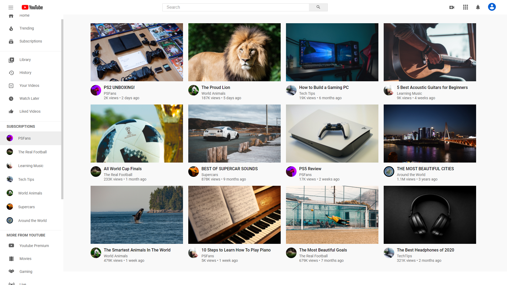

<h1>
YouTube UI Clone
</h1>

<h1>
    
</h1>

## 🧾 Sobre

Como o próprio nome sugere, o projeto é uma cópia da interface do YouTube. O projeto foi realizado com o intuito de colocar em prática os estudos realizados e adquirir experiência com as tecnologias.

## 💻 Tecnologias utilizadas

- HTML
- CSS

## 📚 Tutorial

A realização do projeto só foi possível com a ajuda do seguinte vídeo:

https://www.youtube.com/watch?v=jTbT1RbICDQ&ab_channel=adamthedev
